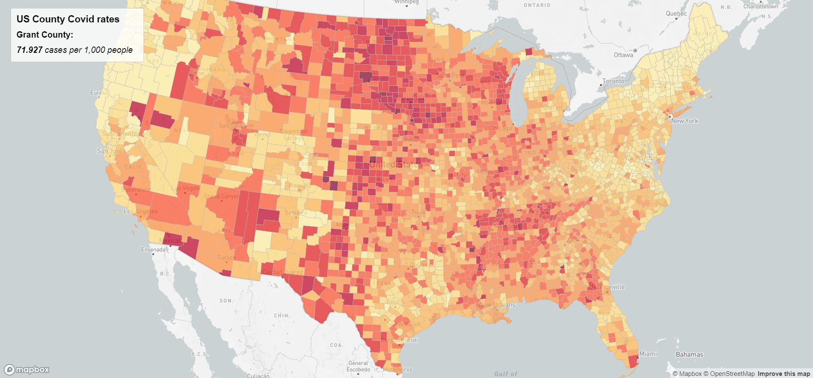
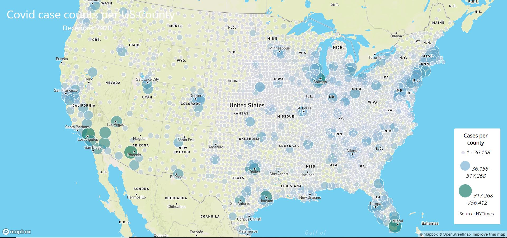

# Lab 3: Web Map Application-By Adam Nicewarner

In this project, we use 2 different datasets to show the COVID counts and rates among counties in the USA in 2020.

Rate map: https://adam-nicewarner.github.io/CovidMaps2020/map1.html

Count map: https://adam-nicewarner.github.io/CovidMaps2020/map2.html

They each have an interactive element. In the rate map, if you hover over a county, you can see the counties name, as well as it's Covid rate per thousand residents. In the count map, if you click a dot, which represents a county, you can see the number of cases that county has, as well as their name. I have used the mapbox library, as well as the NYTimes Files in order to create this map. This was a task performed with the help of the Geography department of UW, specifically professor Bo Zhao.

